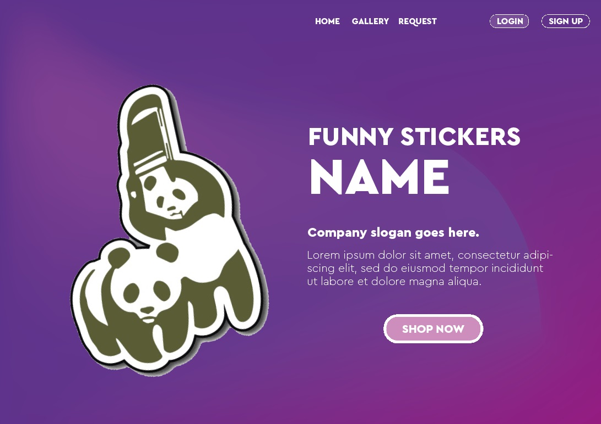
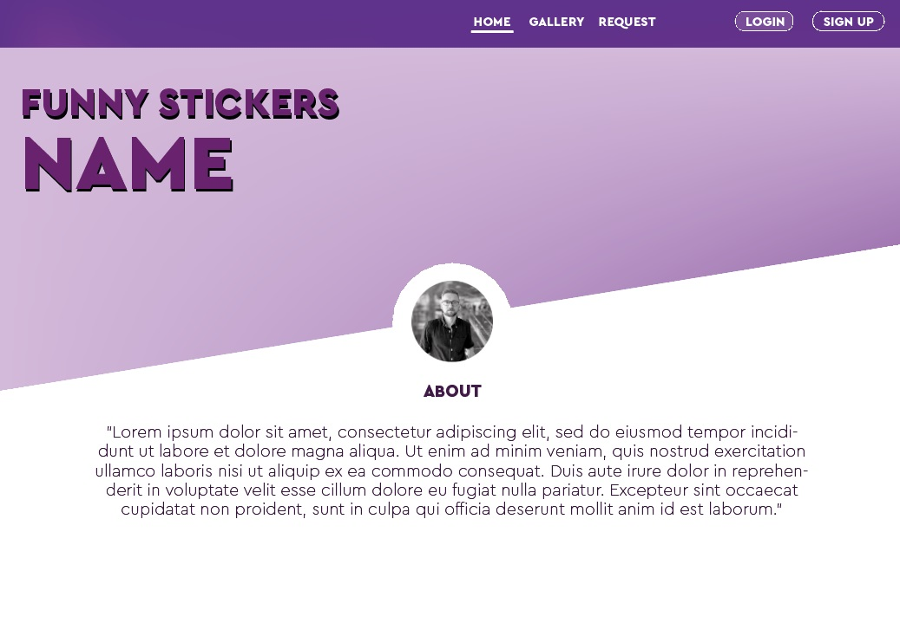
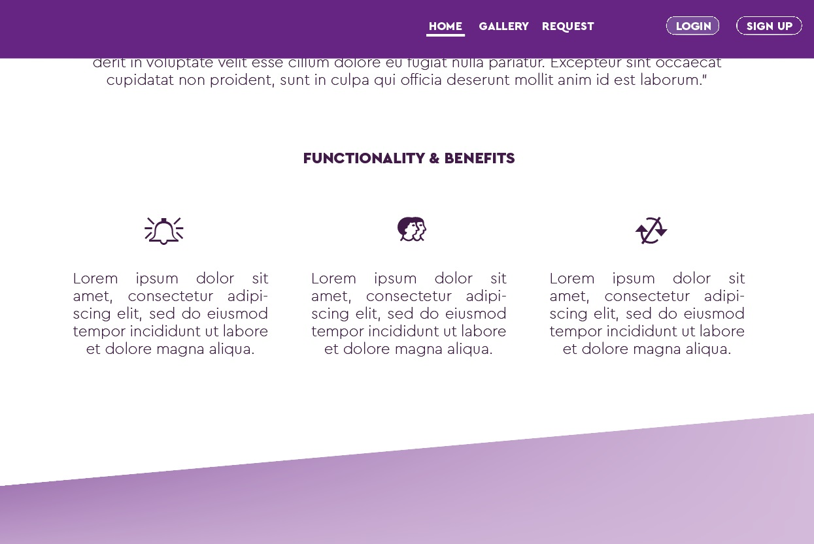
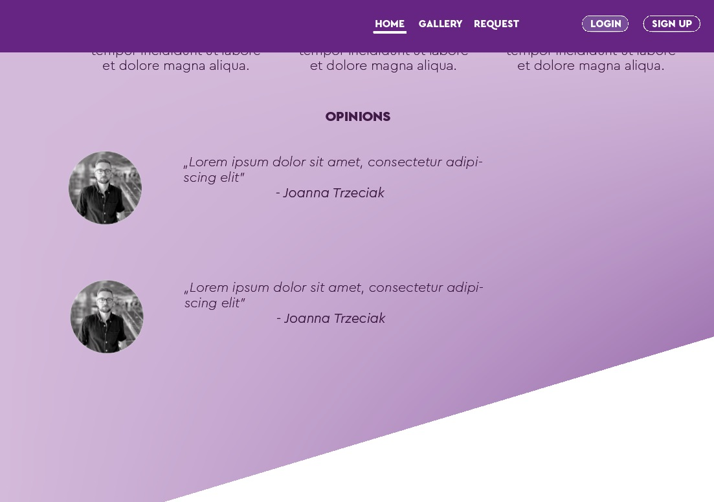
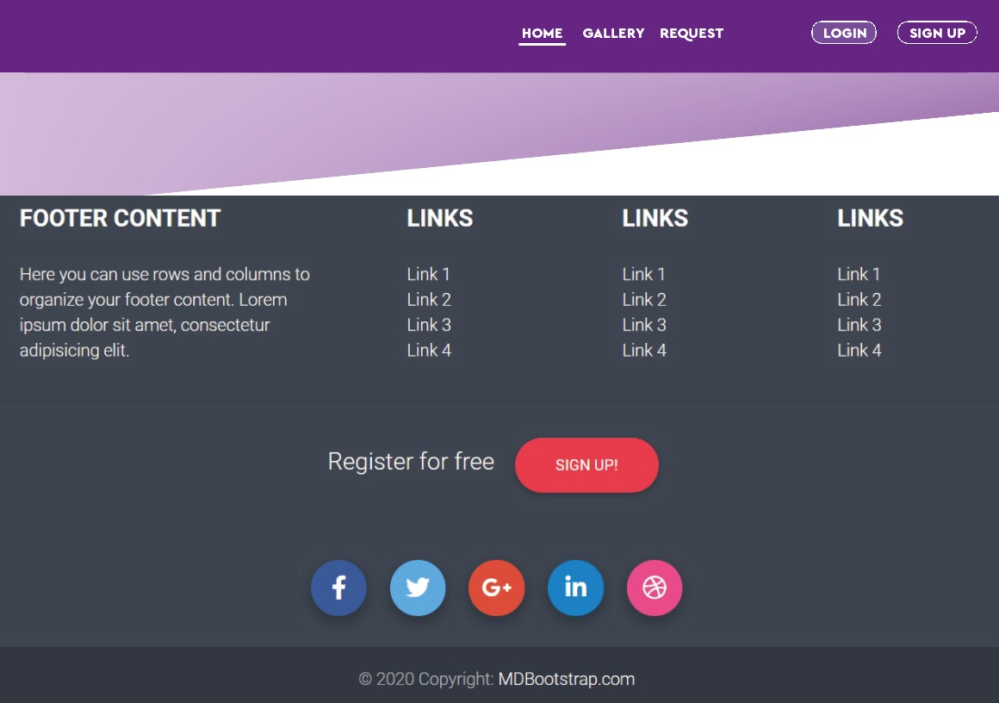
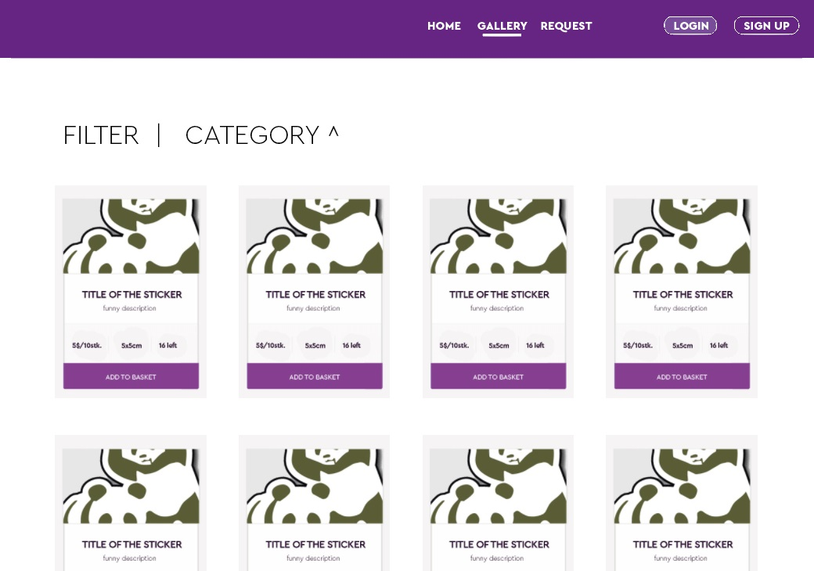
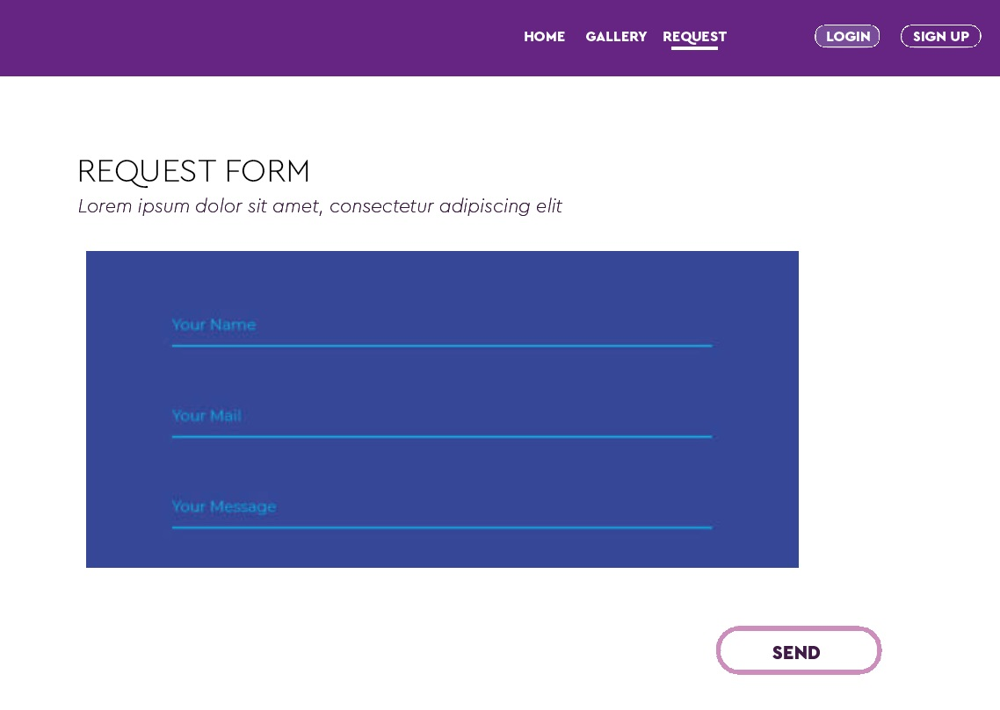

..........................

# PJ - Stickers

Buy our eco-friendly, inspiring fun and smart stickers! Get your personalized design and stand out with your stickers? High quality print, free delivery in Amsterdam area and more. 

## UX

PJ - Stickers in an e-commerce website.
It provides sets ready stickers to purchase as well as form to request custom design.

User can register to Partal, creating profile. 
Log in/out functionality. 

## USER STORIES
### Epic:
As a user, I want to purchase eco-friendly stickers 
### Detailed:
As a private person (resident of Amsterdam), I want to purchase already created eco stickers so that I can use them as an inspiration at my party/ wrap my gifts/ promote my ideas and be sure that I am helping the environment. 
Ensure enough inspirational stickers for any occasion
- Promote sustainability on each sticker
- Create a promo code for first purchase
- Create company/ private user field within account setup 
- Promote free delivery within Amsterdam borders

As a new business owner, I want to purchase custom made eco stickers so that I can promote my company/ run the campaign and use sustainability as a promotional factor creating a positive image of the newly created brand. 
- Create friendly request form 
- Promote sustainability on each sticker

As a company, I want to purchase a design of eco stickers so that I can advertise in the fairs/ increase my audience via branding/ have it for internal use and in any case promote sustainability which aligns with the vision of my company. 
- Create company/ private user field within account setup 
- Promote sustainability on each sticker
- Create discounts on larger purchases 

## Features

Logo at the top left corner (self designed)
- a link to home page
Home btn
-a link to home page

Teaser
-short description of the portal

Content
-list of cards with stickers.

Footer
- social links for promotional and communication purposes.
- a link to author's GitHub profile
- copyright

### In the future:
- user purchase history
- more content

## Technologies Used
### Languages
- HTML
- CSS
- JavaScript
- Python
- django
- Stripe payments

### Libraries
- Bootstrap (https://getbootstrap.com/)
- Fontawesome (https://fontawesome.com/)

### Database
- AWS s3
- local sqlite

## Credits

### Content

## Use of other code.
- footer source(edited)  https://colorlib.com/wp/bootstrap-footer/

- I use fragments of the code from previous lessons of Code Institure.
All codes were sourced from my own profile on GitHub portal
Parts of the code were edited and adjust to page layout.

### Media
Some stickers were downloaded for free picture collection https://www.pexels.com/
Icons were taken from font awesome portal.
Entire text was edited by author.

### Acknowledgments

- I received inspiration for this project from various lessons conducted at Code Institute

..........................

# WIREFRAMES
An early stage draft of the app. Changes appied. 

### Home page top

### Home page about

### Home page benefits

### Home page quotes

### Footer

### Gallery

### Request Form

--------

